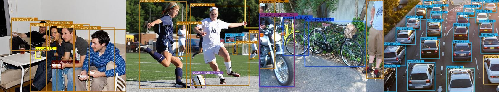

# 说明文档

<div align="center">



# CmakeFull
**该仓库集成了采图、标定、深度学习推理、下游任务模块，旨在快速实现产品开发**

</div>


## 模块说明

### 采图模块

| 相机品牌 | arm | x86 | rgb | pcd |
| :--------: | :-----: | :-----: | :------: | :------: |
| Orbbec |  | &check; | &check;  |   |

### 标定模块

### 推理模块（包含预处理、推理、后处理）

| 模型 | 类型 | MNN | NCNN  | OpenVINO |
| :--------: | :-----: | :-----: | :------: | :------: |
| NanoDet | 目标检测 | &check; | &check; | &check; |

### 任务模块

基于推理结果进行下游任务

## 部署指南

### 临时指定动态链接库（.so 文件）搜索路径

```
source /usr/local/setupvars.sh  // 激活 openvino 环境

export LD_LIBRARY_PATH=$LD_LIBRARY_PATH:$(pwd)/install/lib
export LD_LIBRARY_PATH=$LD_LIBRARY_PATH:$(pwd)/3rdparty/orbbec/lib_x64
export LD_LIBRARY_PATH=$LD_LIBRARY_PATH:$(pwd)/3rdparty/MNN/lib
export LD_LIBRARY_PATH=$LD_LIBRARY_PATH:$(pwd)/3rdparty/NCNN/lib/cmake/ncnn
```


## 拓展知识

[C++重定义、usb设备打开](docs/utils.md)

